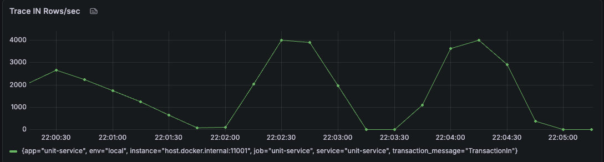
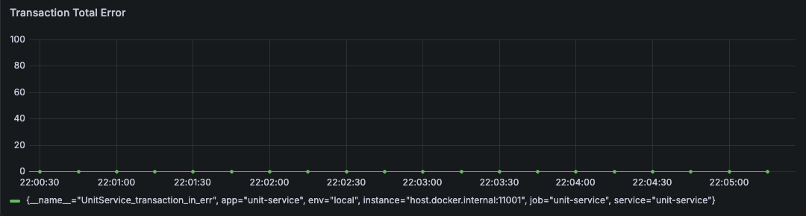

# unit-service

`unit-service` is a Go framework template for building services in a microservices architecture.

The project is designed as a reusable foundation for data-processing services that:

- read data from an input queue,
- enrich data with reference information,
- transform messages into domain transactions,
- persist transactions to analytical storage,
- optionally publish processed data to another queue.

## Architectural Style

The framework is built on top of:

- `Dependency Injection`
- `Interfaces`
- `DDD (Domain-Driven Design)`

These principles are used to keep the codebase modular, testable, and easy to adapt for different microservices.

## Main Goals

- provide a clean base for microservices,
- separate infrastructure concerns from business logic,
- make dependencies replaceable through interfaces,
- simplify evolution of queue consumers, processors, and storage adapters,
- support controlled concurrency and graceful shutdown.

## High-Level Architecture

The current structure is organized into several layers:

```text
cmd/
  unit-manager/         application entrypoint

internal/
  app/                  application bootstrap and runtime orchestration
  config/               configuration loading from YAML and environment
  model/
    dao/                persistence models
    dto/                transport and transformation models
  repository/           storage and queue adapters
  store/                connection lifecycle and low-level clients
  usecase/              application and business use cases
```

## Layer Responsibilities

### `cmd/unit-manager`

Application startup entrypoint.

Responsibilities:

- initialize the application,
- load configuration,
- start runtime processes,
- integrate profiling or process-level tools if needed.

### `internal/app`

Composition root of the framework.

Responsibilities:

- construct the dependency graph,
- initialize stores, repositories, and use cases,
- manage application lifecycle,
- run service modes and coordinate shutdown.

### `internal/config`

Configuration layer.

Responsibilities:

- read YAML config,
- override values from environment variables,
- expose typed configuration structures for all subsystems.

### `internal/store`

Infrastructure connection layer.

Responsibilities:

- create and manage connections to external systems,
- encapsulate lifecycle methods such as `Open`, `Ping`, and `Close`,
- provide access to underlying clients for repositories.

Examples of managed infrastructure:

- MySQL / reference DB,
- Redis / queue DB,
- ClickHouse / transaction DB.

### `internal/repository`

Persistence and transport adapter layer.

Responsibilities:

- execute database operations,
- consume and publish queue messages,
- persist analytical transactions,
- isolate storage-specific code from business use cases.

The repository layer depends on `store` and exposes domain-oriented operations through interfaces.

### `internal/usecase`

Application/business use-case layer.

Responsibilities:

- coordinate message processing flow,
- read reference data,
- perform business transformations,
- buffer and flush transactions,
- control queue workers and service behavior during runtime.

This is the main orchestration layer of the framework.

### `internal/model/dao`

Persistence-oriented models.

Used for:

- ClickHouse row structures,
- reference table mapping,
- storage-specific object representation.

### `internal/model/dto`

Transport and conversion models.

Used for:

- queue message representation,
- transformation between external message format and internal structures,
- intermediate processing payloads.

## Dependency Injection

The framework uses constructor-based dependency injection.

Typical dependency flow:

```text
config
  -> store
  -> repository
  -> usecase
  -> app runtime
```

Benefits:

- easier testing with mocks and stubs,
- explicit dependency graph,
- simpler replacement of infrastructure adapters,
- reduced hidden coupling between layers.

## Interfaces

Interfaces are used as contracts between layers:

- `store` defines infrastructure access contracts,
- `repository` exposes storage/queue operations,
- `usecase` defines application-level behavior.

This allows:

- easy replacement of implementations,
- independent testing of layers,
- safer long-term refactoring.

## DDD Orientation

This project is not a full strict DDD implementation, but it follows DDD-oriented design principles:

- domain behavior is separated from infrastructure code,
- models are split by responsibility (`dao` vs `dto`),
- use cases coordinate business scenarios instead of embedding logic in repositories,
- infrastructure adapters are kept outside the application flow.

The intended evolution path is:

- enrich domain models,
- introduce explicit business rules and policies,
- move toward richer domain services where needed.

## Current Processing Pipeline

The framework currently models the following runtime flow:

1. load reference data,
2. start queue workers,
3. consume input messages,
4. enrich and transform messages,
5. buffer transactions,
6. flush transactions to ClickHouse,
7. optionally publish processed output to a producer queue.

## Concurrency Model

The queue processing layer is designed around a fixed worker pool.

Current goals of this model:

- bounded concurrency,
- controlled memory usage,
- graceful drain on shutdown,
- predictable queue-processing throughput.

## Performance

The framework is designed for high-throughput transaction processing.  
Under the current implementation and benchmark conditions, the target processing rate is **up to 4,000 transactions per second (TPS)**.

The achieved throughput depends on several factors, including:

- available CPU and memory resources,
- ClickHouse performance,
- queue throughput,
- transaction complexity,
- deployment configuration.

The following benchmark demonstrates the current performance characteristics of the framework:




## Robustness

The framework is designed to tolerate temporary unavailability of the ClickHouse database.
If the connection to ClickHouse is lost, transactions that have already been generated by the processing pipeline are **not discarded**. Instead, the application switches into a recovery mode, where it continuously waits for and probes the ClickHouse instance until the connection is restored.
Once ClickHouse becomes available again, the application resumes normal operation and continues persisting transactions without requiring a restart.
This behavior ensures that temporary ClickHouse outages do not result in transaction loss and allows the service to recover automatically after the database becomes available.

## Why This Project Works Well as a Microservice Framework

This project is intended to be used as a base framework for microservices because it already provides:

- clear layering,
- pluggable infrastructure through interfaces,
- DI-based composition,
- queue-consumer processing model,
- analytical storage integration,
- a place for service-specific business logic,
- room for extension without breaking existing contracts.

Each concrete microservice can reuse the framework and customize:

- queue schemas,
- reference datasets,
- domain transformations,
- transaction persistence rules,
- runtime policies and recovery behavior.

## Recommended Next Evolution Steps

As the framework grows, the following improvements are natural next steps:

- strict configuration validation,
- clearer health/recovery state management,
- fully enabled producer queue stage,
- explicit metrics and observability,
- richer domain services and policies,
- stronger integration and load testing.

## Summary

`unit-service` is a framework-style foundation for microservices built with Go and structured around:

- `Dependency Injection`,
- `Interfaces`,
- `DDD-oriented layering`.

Its purpose is to provide a clean, extensible, and maintainable base for services that process queue data, enrich it with reference information, and persist domain transactions into analytical storage.
